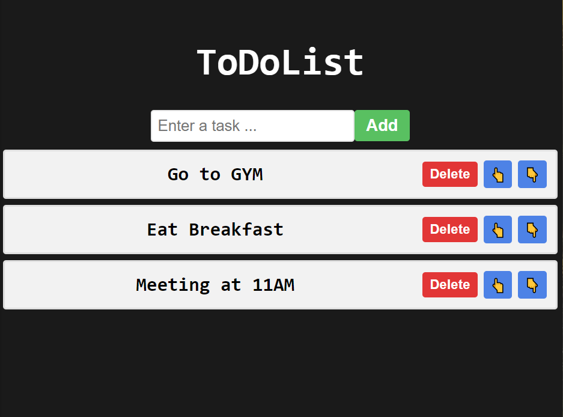

# ToDoList

## Overview

This is a basic ToDo list web application built with React, allowing users to add, delete, and reorder tasks.

## Features

**Add Task:**
Enter a task in the input field.
Click the "Add" button to add the task to the list.

**Delete Task:**
Each task has a "Delete" button to remove it from the list.

**Reorder Tasks:**
Use the "👆" button to move a task up in the list.
Use the "👇" button to move a task down in the list.

## App

